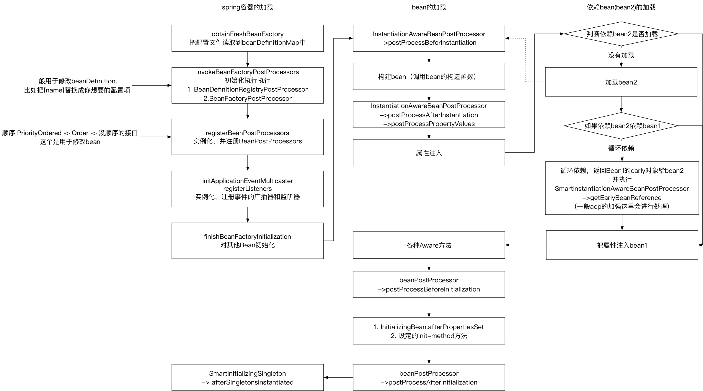

# Spring IOC 源码分析

spring的ioc加载部分源码最近看了下，这里总结下

## spring 整个的生命周期
spring 容器起来
1. BeanDefinitionRegistryPostProcessor实例化，然后执行
2. BeanFactoryPostProcessor实例化，然后执行  
    上面两个一般用于修改beanDefinition
3. 实例化，注册BeanPostProcessors  
    这是bean进行处理

然后初始化所有非lazy加载的bean，流程
1. InstantiationAwareBeanPostProcessor.postProcessBeforInstantiation
2. 实例化bean 
3. InstantiationAwareBeanPostProcessor.postProcessAfterInstantiation
4. InstantiationAwareBeanPostProcessor.postProcessPropertyValues 可以处理要set的属性
5. 属性填充，去get其他的bean
    如果被其他的bean循环依赖的话
    会调用SmartInstantiationAwareBeanPostProcessor.getEarlyBeanReference
    加强的类如果循环依赖，这里就需要生成代理类了
6. 各种aware方法
7. beanPostProcessor.postProcessBeforeInitialization
8. InitializingBean.afterPropertiesSet
9. 设定的init-method方法
10. beanPostProcessor.postProcessAfterInitialization

然后加载完成之后
执行SmartInitializingSingleton.afterSingletonsInstantiated



## 源码分析

spring 容器启动的流程主要是在 
AbstractApplicationContext.refresh里

#### AbstractApplicationContext.refresh

1. obtainFreshBeanFactory

        初始化beanFacotry with 加载 beanDefinitions  
        这一步的目的，把配置文件对信息解析出来，放到  Map<String, BeanDefinition> beanDefinitionMap 里。

 2. prepareBeanFactory     做一些准备工作
 3. postProcessBeanFactory
 4. invokeBeanFactoryPostProcessors

    1. 执行BeanDefinitionRegistryPostProcessor
        比如ConfigurationClassPostProcessor, 使用@Config
        BeanFactoryPostProcessor 的扩展，允许在常规BeanFactoryPostProcessor 检测开始前注册更多的bean定义。
        可以用来注册一个BeanFactoryPostProcessor
        
    2. 执行BeanFactoryPostProcessor
        一般用于处理beanDefinition

5. registerBeanPostProcessors

        注册BeanPostProcessors,把所有的BeanPostProcessors 注入到BeanFactory
        顺序 PriorityOrdered -> Order -> 没顺序的接口

6. initMessageSource  初始化消息源 ，国际化的一些东西
7. initApplicationEventMulticaster  

     事件的分发器，由这里广播。这里把它注册到beanFactory里

8. onRefresh 初始化特殊bean
9. registerListeners 

     把实现监听Listener的都add到 上面的广播器里

10. finishBeanFactoryInitialization

    例化所有非懒加载的所有bean

11. finishRefresh

    实现Lifecycle 的，调用 start
    发布加载完成消息ContextRefreshedEvent


###  beanDefinition 加载
最后会执行到  
DefaultBeanDefinitionDocumentReader.doRegisterBeanDefinitions(Element root)  
并且对不同的bean有不同的解析逻辑 (alias, bean, beans, import)
```
    private void parseDefaultElement(Element ele, BeanDefinitionParserDelegate delegate) {
        if (delegate.nodeNameEquals(ele, IMPORT_ELEMENT)) {
            importBeanDefinitionResource(ele);
        }
        else if (delegate.nodeNameEquals(ele, ALIAS_ELEMENT)) {
            processAliasRegistration(ele);
        }
        else if (delegate.nodeNameEquals(ele, BEAN_ELEMENT)) {
            processBeanDefinition(ele, delegate);
        }
        else if (delegate.nodeNameEquals(ele, NESTED_BEANS_ELEMENT)) {
            // recurse
            doRegisterBeanDefinitions(ele);
        }
    }
```
主要看下bean类型的  
把会把配置的相关属性解析后放入到BeanDefinition中， 然后加载到beanDefinitionMap中
```
    AbstractBeanDefinition bd = createBeanDefinition(className, parent);
    parseBeanDefinitionAttributes(ele, beanName, containingBean, bd);
    bd.setDescription(DomUtils.getChildElementValueByTagName(ele, DESCRIPTION_ELEMENT));
    parseMetaElements(ele, bd);
    parseLookupOverrideSubElements(ele, bd.getMethodOverrides());
    parseReplacedMethodSubElements(ele, bd.getMethodOverrides());
    parseConstructorArgElements(ele, bd);
    parsePropertyElements(ele, bd);
    parseQualifierElements(ele, bd);
```

### finishBeanFactoryInitialization 初始化普通的bean

主要逻辑在beanFactory.preInstantiateSingletons();

对所有非lazy加载的单例bean进行加载
```
for (String beanName : beanNames) {
			RootBeanDefinition bd = getMergedLocalBeanDefinition(beanName);
			if (!bd.isAbstract() && bd.isSingleton() && !bd.isLazyInit()) {
            ... // 这里对Factory进行了判断，最后会执行getBean(beanName）
            }
}
```

最后，对所有实现了SmartInitializingSingleton 的bean，回调
```
	for (String beanName : beanNames) {
			Object singletonInstance = getSingleton(beanName);
            if (singletonInstance instanceof SmartInitializingSingleton) {
				final SmartInitializingSingleton smartSingleton = (SmartInitializingSingleton) singletonInstance;
	            smartSingleton.afterSingletonsInstantiated();
            }
    }
```

### getBean的逻辑 - doGetBean

最后执行到doGetBean函数中

主要列下单例的逻辑这里
```
// 获取到真实的beanName
final String beanName = transformedBeanName(name);

// 尝试从缓存中取，这里解决循环依赖问题
Object sharedInstance = getSingleton(beanName);
    get一个提前对象
    ObjectFactory<?> singletonFactory = this.singletonFactories.get(beanName);
    if (singletonFactory != null) {
        singletonObject = singletonFactory.getObject();
        this.earlySingletonObjects.put(beanName, singletonObject);
        this.singletonFactories.remove(beanName);
    }

if (sharedInstance != null && args == null) {
    // 如果是FactoryBean 则返回转化的bean
	bean = getObjectForBeanInstance(sharedInstance, name, beanName, null);
}
...

// 放入 singletonsCurrentlyInCreation
getSingleton.beforeSingletonCreation

// 处理InstantiationAwareBeanPostProcessor 这个在bean的实例化之前
creatBean -> resolveBeforeInstantiation

// 实例化bean
instanceWrapper = createBeanInstance(beanName, mbd, args);
bean = instanceWrapper.getWrappedInstance()
    ->instantiateBean
        -> BeanUtils.instantiateClass(constructorToUse)， java反射 Constructor.newInstance
        -> 如果有需要覆盖的方法，使用cglib动态代理

// 加入预加载的单例factory（用于解决循环依赖问题）
this.singletonFactories.put(beanName, new ObjectFactory<Object>() {
    @Override
    public Object getObject() throws BeansException {
        return getEarlyBeanReference(beanName, mbd, bean);
    }
});
this.earlySingletonObjects.remove(beanName);
this.registeredSingletons.add(beanName);


populateBean(beanName, mbd, instanceWrapper);
    // InstantiationAwareBeanPostProcessor.postProcessAfterInstantiation 实例化之后调用, 属性填充前
    // byName,byType 放入PropertyValues中
    // InstantiationAwareBeanPostProcessor.postProcessPropertyValues 对属性注入前，对属性进行处理
    // 属性填充
    -> applyPropertyValues(beanName, mbd, bw, pvs);
        如果没有实例化的化，这里会去创建
        使用beanWarp最后是找到 set方法，然后反射把值set到参数里去

// 调用初始化方法
initializeBean
    -> 各种aware方法
    -> beanProcessor.postProcessBeforeInitialization
    -> InitializingBean.afterPropertiesSet
    -> 设定的init方法
    -> beanProcessor.postProcessAfterInitialization

删除singletonsCurrentlyInCreation

加进构建完成的 singletonObjects中
    synchronized (this.singletonObjects) {
        this.singletonObjects.put(beanName, (singletonObject != null ? singletonObject : NULL_OBJECT));
        this.singletonFactories.remove(beanName);
        this.earlySingletonObjects.remove(beanName);
        this.registeredSingletons.add(beanName);
    }

```


## 其他
### beanFactory中一些变量的作用

bean的定义的池子  
Map<String, BeanDefinition> beanDefinitionMap = new ConcurrentHashMap<String, BeanDefinition>(64);

单例创建完成的池子  
private final Map<String, Object> singletonObjects = new ConcurrentHashMap<String, Object>(64);

正在创建的bean  
singletonsCurrentlyInCreation 

下面两个循环依赖使用：  
earlySingletonObjects 循环依赖提前创建的缓存区  
- 没创建完，但是被循环依赖了，先一个构建中的放在这里
- 被循环依赖时添加，创建完成删除

singletonFactories 用于保存创建备案的工厂之间的关系  
- 供构建中对象的工厂
- 构建时添加
- 循环依赖 or 构建完成时 删除
