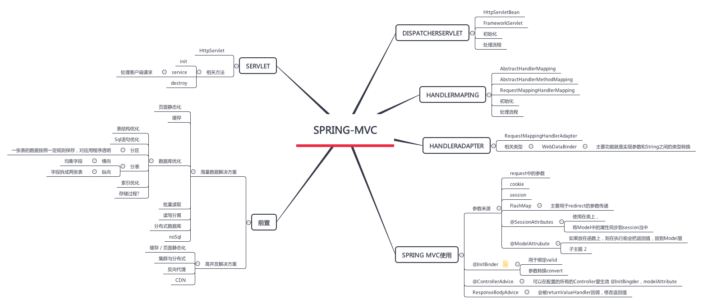
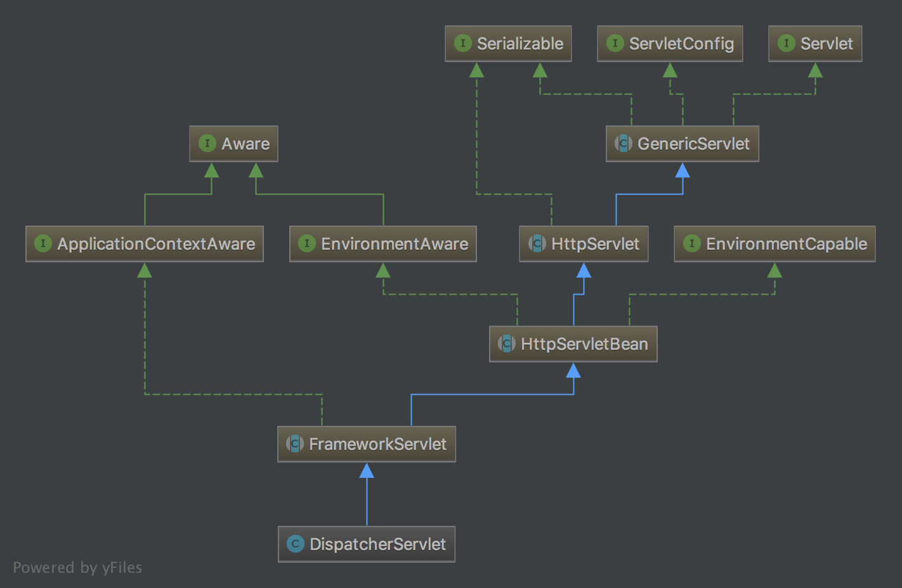

# Spring-MVC 学习 & 源码阅读总结



## DispatcherServlet



### 初始化
- HttpServletBean web.xml中配置的参数设置到Servlet中
    - 把servlet中的参数直接封装到pvs变量中
    - 会调用子类的initServletBean进行初始化
- FrameworkServlet 和spring关联
    - initWebApplicationContext 初始化WebApplicationContext
        - 获取跟容器rootContext
        - 设置初始化WebApplicationContext
            - configureAndRefreshWebApplicationContext
        - 将初始化WebApplicationContext设置到到ServletConext中
    - initFrameworkServlet 调用子类的这个方法
    
链路 onRefresh->initStrategies, 初始化9个组建的
```
initMultipartResolver(context);
initLocaleResolver(context);
initThemeResolver(context);
initHandlerMappings(context);
initHandlerAdapters(context);
initHandlerExceptionResolvers(context);
initRequestToViewNameTranslator(context);
initViewResolvers(context);
initFlashMapManager(context);
```

默认的组建放在DispatcherServlet.properties里
```

org.springframework.web.servlet.LocaleResolver=org.springframework.web.servlet.i18n.AcceptHeaderLocaleResolver

org.springframework.web.servlet.ThemeResolver=org.springframework.web.servlet.theme.FixedThemeResolver

org.springframework.web.servlet.HandlerMapping=org.springframework.web.servlet.handler.BeanNameUrlHandlerMapping,\
	org.springframework.web.servlet.mvc.annotation.DefaultAnnotationHandlerMapping

org.springframework.web.servlet.HandlerAdapter=org.springframework.web.servlet.mvc.HttpRequestHandlerAdapter,\
	org.springframework.web.servlet.mvc.SimpleControllerHandlerAdapter,\
	org.springframework.web.servlet.mvc.annotation.AnnotationMethodHandlerAdapter

org.springframework.web.servlet.HandlerExceptionResolver=org.springframework.web.servlet.mvc.annotation.AnnotationMethodHandlerExceptionResolver,\
	org.springframework.web.servlet.mvc.annotation.ResponseStatusExceptionResolver,\
	org.springframework.web.servlet.mvc.support.DefaultHandlerExceptionResolver

org.springframework.web.servlet.RequestToViewNameTranslator=org.springframework.web.servlet.view.DefaultRequestToViewNameTranslator

org.springframework.web.servlet.ViewResolver=org.springframework.web.servlet.view.InternalResourceViewResolver

org.springframework.web.servlet.FlashMapManager=org.springframework.web.servlet.support.SessionFlashMapManager
```

### 处理请求
- FrameworkServlet 会把doGet，doPost等方法合并到processRequest(request, response)里
    - doService
    - 发布完之后，发布ServletRequestHandledEvent 

- mappedHandler = getHandler(processedRequest); 得到Handler
- HandlerAdapter ha = getHandlerAdapter(mappedHandler.getHandler()); 得到HandlerAdapter
- mappedHandler.applyPreHandle(processedRequest, response)  执行相应的Interceptor before
- mv = ha.handle(processedRequest, response, mappedHandler.getHandler());   执行这个handler
- mappedHandler.applyPostHandle(processedRequest, response, mv); 执行相应的Interceptor
- processDispatchResult(processedRequest, response, mappedHandler, mv, dispatchException); 处理返回结果
    - 如果有异常 执行processHandlerException， 执行相应的HandlerExceptionResolver
    - 渲染页面
- triggerAfterCompletion ； 执行Interceptor


## HandlerMapping
获取对应的Handler 和Interceptors

### AbstractHandlerMapping 

- List<Object> interceptors = new ArrayList<Object>(); 对应的拦截器
- List<HandlerInterceptor> adaptedInterceptors = new ArrayList<HandlerInterceptor>(); 初始化后，把对应的interceptors放入这里

getHandler调用流程
- 会调用子类的 getHandlerInternal(request); null就返回默认handler
- HandlerExecutionChain executionChain = getHandlerExecutionChain(handler, request);  生成一个HandlerExecutionChain
    - 这里会把adaptedInterceptors匹配的放入HandlerExecutionChain中

### 主要使用的是RequestMappingHandlerMapping

- AbstractHandlerMethodMapping
    - Map<T, HandlerMethod> mappingLookup; 匹配条件 导 HandlerMethod的映射
    - MultiValueMap<String, T> urlLookup  url -> 匹配条件的list
    - 初始化的时候
        - 拿到所有的bean
        - 通过子类的筛选 isHandler
        - 然后调用子类getMappingForMethod(method, userType)，生成合适的匹配条件
        - 然后注册到map里 registerHandlerMethod(handler, invocableMethod, mapping);
    - 调用逻辑
        - 通过url，获取到所有的筛选条件T
        - 调用子类 getMatchingMapping(mapping, request)，获取符合条件的筛选条件
        - 得到最匹配的条件,返回对应的 HandlerMapping

- 实现了isHandler 有@Controller or @RequestMapping，就可以写这个Method

## HandlerAdapter
对Handler的处理

主要总结下 RequestMappingHandlerAdapter

### 初始化
- 初始化ControllerAdviceCache initControllerAdviceCache();
    - 会解析所有的controllerAdvice里的
    - modelAttributeAdviceCache， 没有@RequestMapping && @ModelAttribute
    - initBinderAdviceCache @InitBinder
    - 初始化ResponseBodyAdvice
- argumentResolvers初始化
- initBinderArgumentResolvers 初始化
- returnValueHandlers 初始化

### 调用链路
- handleInternal
    - invokeHandlerMethod(request, response, handlerMethod);
        - 初始化ServletWebRequest
        - WebDataBinderFactory 
        - modelFactory
            - 处理器处理前对model初始化
                - sessionAttributes 设置到model
                - modelAttribute 
            - 处理后对model参数更新
        - ServletInvocableHandlerMethod
        - ModelAndViewContainer
        - 执行 invocableMethod.invokeAndHandle(webRequest, mavContainer);

## 其他
### Servlet

- GenericServlet
    - 实现了Servlet和ServletConfig，可以直接用ServletConfig
- HttpServlet
    - 根据请求类型，转化为不同的方法去做， doGet,doPost