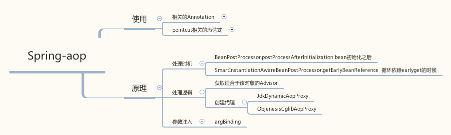
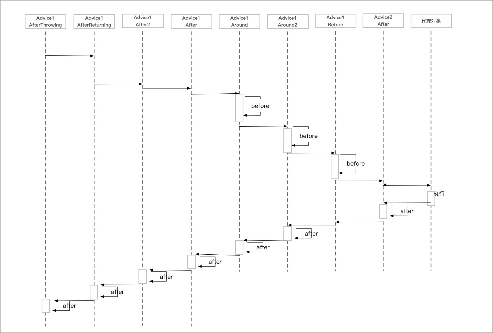

# 浅析 Spring Aop 

aop也是Spring里比较重要的一个点，最近把源码看了下，这里总结一下



使用上主要就下面的点注意下：

- 相关的Annotaion
	- Around
    - Before
    - After
    - AfterReturning
    - AfterThrowing
    - 执行顺序 
- expression表达式
    - execution
    - args
    - @args()
    - this()
    - target()
    - within()
    - @within()
    - @annotation
- 处理函数的相关参数
    - ProceedingJoinPoint
    - returning (AfterReturning 可以设置)
    - Exception (AfterThrowing 可以设置)
    - 然后其他的参数，或者target，annotaion之类的，可以通过expression拿到（除了execution）

然后主要针对源码总结一下


## 1. 注册逻辑
正常通过下面的配置来实现配置

```
    <aop:aspectj-autoproxy proxy-target-class="true"/>
```

然后最后会加载AnnotationAwareAspectJAutoProxyCreator

```
AopNamespaceHandler 会解析aspectj-autoproxy
		registerBeanDefinitionParser("aspectj-autoproxy", new AspectJAutoProxyBeanDefinitionParser());

AspectJAutoProxyBeanDefinitionParser 会调用
    AopNamespaceUtils.registerAspectJAnnotationAutoProxyCreatorIfNecessary(parserContext, element);

最后会注册一个AnnotationAwareAspectJAutoProxyCreator， 这个就是
		return registerOrEscalateApcAsRequired(AnnotationAwareAspectJAutoProxyCreator.class, registry, source);

注入proxy-target-class (默认false，true的化，直接走cglib动态代理，不走jdk)
注入expose-proxy 
        解决 自己调用自己不能被spring监控的问题
        设为true之后，可以使用 (MyService)(AopContext.currentProxy()).doAnotherFunction()
```


## 2. 加强的时机

加强逻辑在AbstractAutoProxyCreator中  
proxy逻辑在是在wrapIfNecessary(bean, beanName, cacheKey);  
可以看到加强的地方是在

- SmartInstantiationAwareBeanPostProcessor.getEarlyBeanReference
- InstantiationAwareBeanPostProcessor.postProcessBeforeInstantiation

这个调用的地方，和为什么这么使用可以看下 
[浅述 Spring 代理如何在循环依赖中解决的](spring-aop与循环依赖.md)


## 3. 具体加强的判断

主要在wrapIfNecessary中

1. 判断是否需要代理  
    过滤Advice等不需要代理的类
2. 获取所以可以适用于这个类的Advice
3. 根绝advice生成代理类
    
```
// 判断是否这个bean需要被代理
// isInfrastructureClass 如果是基础类，就不需要被代理 Advice， Advisor, AopInfrastructureBean, 或者实现了@Aspect
// shouldSkip 这里处理配置 Advice配置的aspectName
if (isInfrastructureClass(bean.getClass()) || shouldSkip(bean.getClass(), beanName)) {
    this.advisedBeans.put(cacheKey, Boolean.FALSE);
    return bean;
}
// 获取所以可以适用于这个类的Advice
Object[] specificInterceptors = getAdvicesAndAdvisorsForBean(bean.getClass(), beanName, null);

// 这里创建代理类
Object proxy = createProxy(bean.getClass(), beanName, specificInterceptors, new SingletonTargetSource(bean));
```

### 3.1 获取所以可以适用于这个类的Advice
```
protected List<Advisor> findEligibleAdvisors(Class<?> beanClass, String beanName) {
    //找到所有的Advisor
    List<Advisor> candidateAdvisors = findCandidateAdvisors();
    // 找到适应于这个bean的Advisor
    List<Advisor> eligibleAdvisors = findAdvisorsThatCanApply(candidateAdvisors, beanClass, beanName);
    extendAdvisors(eligibleAdvisors);
    if (!eligibleAdvisors.isEmpty()) {
        // 排序
        eligibleAdvisors = sortAdvisors(eligibleAdvisors);
    }
}
```


1. 找到所有的Advisor
    - 找到所有的Advisor类
    - 然后找到@Aspect注解的Class，通过advisorFactory.getAdvisors(factory)获取
        - 得到该class下除了PointCut外所有的函数
        - 按照 Around.class, Before.class, After.class, AfterReturning.class, AfterThrowing.class 排序
        - 获取没个函数对应的annotaion
            获取该函数的annotaion : Before.class, Around.class, After.class, AfterReturning.class, AfterThrowing.class, Pointcut.class
        - 对于每个标类注解的InstantiationModelAwarePointcutAdvisorImpl， 这是一个advisor
            - 会针对不同的annotaion返回不通的Advice (atAspectJAdvisorFactory.getAdvice)
            - Before : AspectJMethodBeforeAdvice
            - After : AspectJAfterAdvice
            - Around : AspectJAroundAdvice
            - AfterReturning : AspectJAfterReturningAdvice
            - AfterThrowing : AspectJAfterThrowingAdvice
2. 找出可以Apply的Advisor
    - 这里就是把Advisor的表达式取出来和bean的class的每个函数match一遍，判断是否符合
3. 排序Advisor
    - AspectJPrecedenceComparator进行排序
        - 会根绝Aspect类对应的order值来进行排序
        - 同一个类里的会根据Annotaion的类型来排序
            - afterThrow
            - afterReturning
            - after
            - around
            - before
        - 同一个annotaion就是根据名字排序了
            - around, before 是名字在前的在前
            - after系列是 名字在后的在前
                - 这里的目的就是名字在前的先执行

这里画了一个排序的图：  
Advice1 的优先级 高于Advice2



### 3.2 生成代理
通过cglib或者jdk生产动态代理
```
public AopProxy createAopProxy(AdvisedSupport config) throws AopConfigException {
    if (config.isOptimize() || config.isProxyTargetClass() || hasNoUserSuppliedProxyInterfaces(config)) {
        if (targetClass.isInterface() || Proxy.isProxyClass(targetClass)) {
            return new JdkDynamicAopProxy(config);
        }
        return new ObjenesisCglibAopProxy(config);
    }
    else {
        return new JdkDynamicAopProxy(config);
    }
}
```

#### JdkDynamicAopProxy

实现了InvocationHandler

```
获取适用的advices
List<Object> chain = this.advised.getInterceptorsAndDynamicInterceptionAdvice(method, targetClass);
然后生成ReflectiveMethodInvocation执行
invocation = new ReflectiveMethodInvocation(proxy, target, method, args, targetClass, chain);
retVal = invocation.proceed();
```

#### ObjenesisCglibAopProxy
生成对应的callbacks（MethodInterceptor），设置到Enhancer里
```
protected Object createProxyClassAndInstance(Enhancer enhancer, Callback[] callbacks) {
    enhancer.setInterceptDuringConstruction(false);
    enhancer.setCallbacks(callbacks);
    return (this.constructorArgs != null ?
            enhancer.create(this.constructorArgTypes, this.constructorArgs) :
            enhancer.create());
}
```

