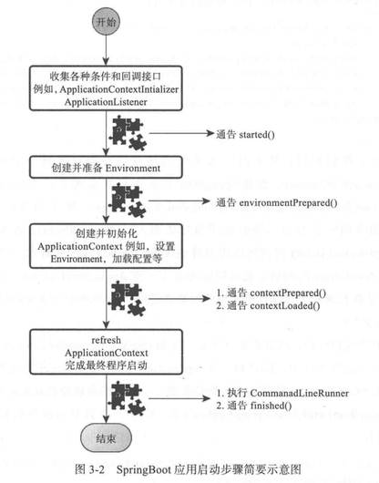

# Spring Boot

- @SpringBootApplication
    - @Configuration
    - @EnableAutoConfiguration
        - import 了EnableAutoConfigurationImportSelector， 自动加载符合条件的Configuraion
            - 使用SpringFactoriesLoader来load
            - 搜索所有META-INF/spring.factories
    - @ComponentScan


### SpringApplication 执行流程

1. 判断是否是web工程，决定是AnnotationConfigEmbeddedWebApplicationContext 或者 ConfigurableWebApplicationContext
2. 创建配置Enviroment
3. 调用SpringApplictionRunListener的envriomentPrePared()
4. 展示Banner
5. 创建，初始化ApplicationContext
6. 调用ApplicationContextInitalizer 初始化
7. 调用SpringApplictionRunListener的contextPrepared
8. 将@enableautoConfigureation获取的配置 的ioc容器加载到ApplicationContext中国年
9. 调用SpringApplictionRunListener的contextLoaded
10. 调用ApplicationContext的refresh
11. CommandLineRunner执行
11. 调用SpringApplictionRunListener的 finished



#### SpringApplicationRunListener

一些springApplication的钩子

```
public interface SpringApplicationRunListener {
	void starting();
	void environmentPrepared(ConfigurableEnvironment environment);
	void contextPrepared(ConfigurableApplicationContext context);
	void contextLoaded(ConfigurableApplicationContext context);
	void finished(ConfigurableApplicationContext context, Throwable exception);
}
```

注意：
自定义实现，需要两个构造参数：
```
public CmdbSpringApplicationRunListener(SpringApplication application, String[] args) {}

使用：
org.springframework.boot.SpringApplicationRunListener=\
com.netease.music.spring.boot.opconfig.autoconfigure.profile.CmdbSpringApplicationRunListener
```

#### ApplicationListener
这个是老spring里用的，监听各种Event

#### ApplicationContextInitializer
在ApplicationContext refresh之前做初始化

#### CommandLineRunner

spring boot中新增的，特别的回调扩展接口。后续展开

### 自动配置

#### 基于条件的自动配置
使用@Condition来设置一个bean是否生效  
有各种Condition的注解，springboot风靡的一个重要原因就是这个。

#### 可以设置顺序
@autoConfigurebefore 或者 @autoConfigureAfter

### 配置项
- 命令行参数
- 系统环境变量
- 文件系统中的配置问及爱你
- classpath中的配置文件
- 固化到代码中的配置项

优先级，从高到低

## Spring-boot-starter
默认约定都以spring-boot-starter-作前缀

### spring-boot-starter-web

#### 项目结构层面的约定
原来放在 src/main/webapp目录下的一系列资源，统一放到src/main/resources 目录。比如：
- src/main/resources/static 放各种静态资源 css,js
- src/main/resources/templates 放模版文件 *.vm

- 默认8080端口，可以使用server.port修改  
    - 提供了很多以server为前缀的配置项

### spring-boot-starter-jdbc

接入数据库

```
spring.datasource.url=...
spring.datasource.username=...
spring.datasource.password=...
```


### spring-boot-starter-aop