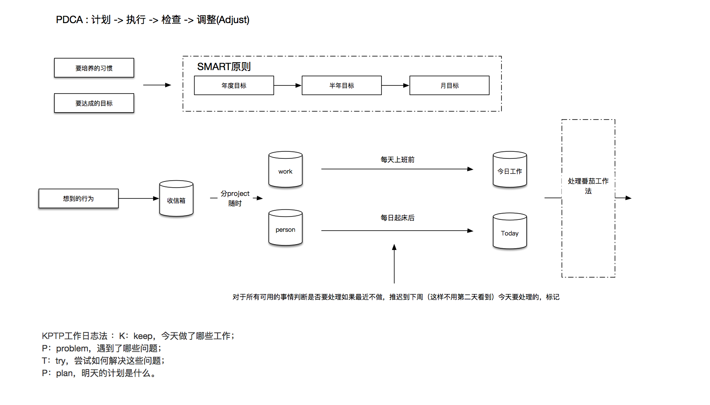

# 时间管理

在看过一些时间管理的书籍后(像GTD，小强升职记), 并有一些自己的实践之后，觉得有必要总结一下自己的时间管理方式。

### 要点

下面几个概念，是在执行过程中觉得比较重要的。具体执行过程，后面详述

1. 收集  
2. 计划  
    SMART原则 : 具体的，可衡量的，可达到的，和自己有关联的，有时限的
3. 执行  
    番茄工作法: 25min休息5min  
    时间记录: 休息时自己做的事情  
    四项工作法： 重要 or 不重要； 紧急 or 不紧急
    6点有限工作法
4. 总结  
    - KPTP 记录法
        - Keep 今天做了哪些工作
        - Problem 哪些问题
        - Try 哪些尝试
        - Plan 明天的计划是什么

### 具体操作

#### 1. 先做好5年后你想要成为什么样的人这样一个畅想

#### 2. 做年度计划
主要分为习惯和目标两个部分  
而计划又可以由下面几个维度拎出来看
- 身体
- 财务
- 人际社群
- 休闲放松
- 体验突破
- 学习成长
- 工作
- 个人项目

#### 3. 日常

1. 突发的事情，2分钟之内的立即解决，其余的放入收件箱（标记为today，这样在今日待办里可以看到）
2. 每天早上看月计划和周计划，然后做今天的计划
    - 调整计划时，注意四项工作原则，重要 > 紧急
    - 这个时候可以调整周计划，尽量不要修改月计划
    - 做每周总结和计划时，修改月计划
    - 做每月总结和计划时，修改年计划
3. 工作时遵循番茄工作法
    - 半小时休息 5min，记录做的事情。
        （这里最好有一个软件，可以反查事情经历的时间段）
    - 休息时间，看一下今日待办，不需要做的事情推迟到指定时间，或者放到另一个需要办的后续
4. 每日总结
    - 总结一下自己做的事情，遇到的问题，尝试了什么
    - 可以在第二天计划前，或者晚上
5. 修改计划，需要在对应的计划里，做记录，方便复查
    - 最好可以甘特图显示

todo:
图差了 时间记录，和总结

omniplan 的问题：
比如今天要做一个项目，今天的一半做完了，但是看不到今天做了半小时
看不到每一个项目经历的时间段
看不到计划 和 实际的对比图
