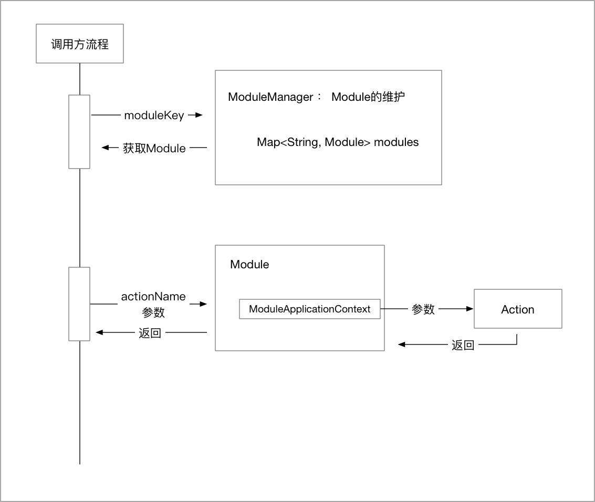
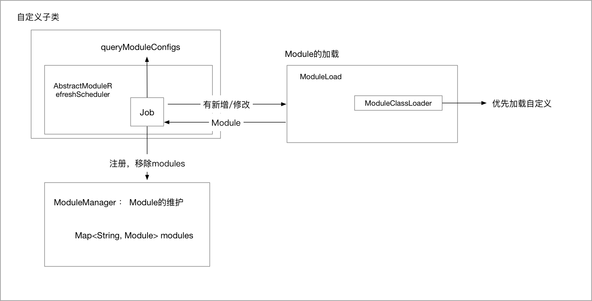
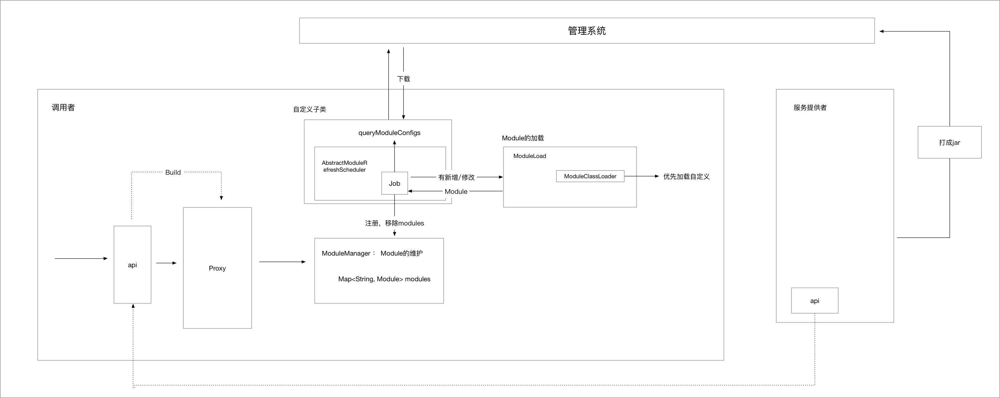

## 简介
基于JAVA的模块化开发框架, 它提供在运行时动态加载模块、卸载模块和模块间调用的API。

## [需求 & 应用场景](https://github.com/alibaba/jarslink/wiki/index-cn)

## 使用

- Module (调用者使用)  
    每一个隔离模块
- Action (提供者实现)  
    模块中的Service

就是BeanFactory 和 bean的关系

## 原理分析
- AbstractModuleRefreshScheduler: 定时刷新模块的抽象类 
- ModuleLoader：模块加载引擎，负责模块加载
- ModuleManager：模块管理者，负责在运行时注册，卸载，查找模块和执行Action
- ModuleClassLoader: 自定义的ClassLoader，不使用双亲委派模型

### 调用方流程

### 刷新流程

## 思考

#### 使用场景
- 中间件动态替换
    - redis
    - kafka
    - memcahce
    - ...

#### 展望

- 提供使用jar包方式调用Module  
    - 原因
        - 目前需要客户端使用moduleName，actionname来调用
        - 看不到module的提供的action的参数 & 返回  
    - 实现方式：
        - 使用builder代理类来实现，使用module及参数传递过程
- 管理系统来自动化部署流程

