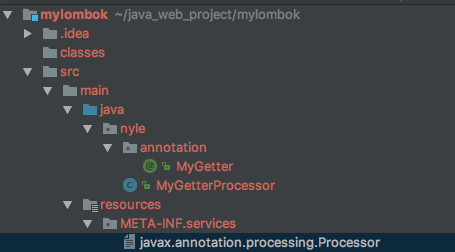
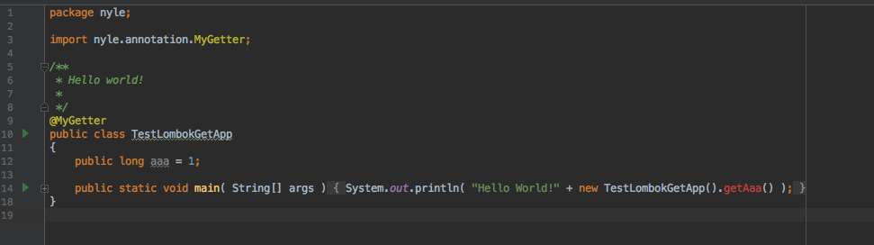
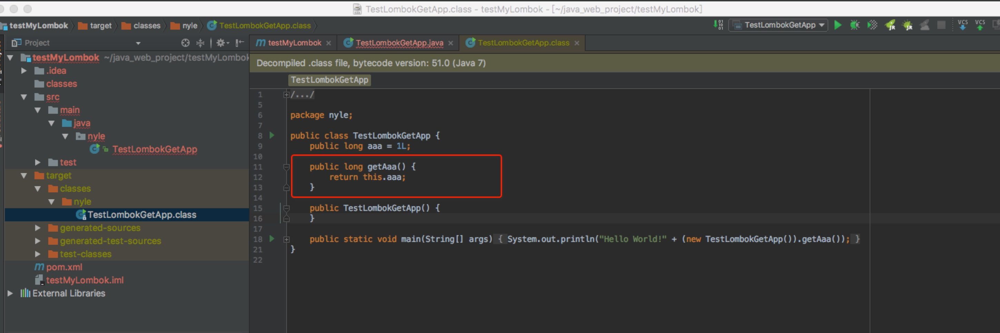
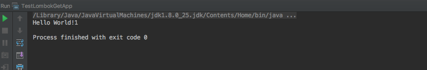

# lombok 使用原理介绍

使用方法这里就不介绍了，主要使用就是加部分支持的Annotation，然后对应的class会得到对应的加强。

简单来说就是在编译器加强了，常见的aop是在运行期进行的加强（另外说下，aspectj也支持编译时增强）


### 原理分析

自从Java 6起，javac就支持“JSR 269 Pluggable Annotation Processing API”规范，只要程序实现了该API，就能在javac运行的时候得到调用。  

lombok本质上就是这样的一个实现了"JSR 269 API"的程序。在使用javac的过程中，它产生作用的具体流程如下：

1. javac对源代码进行分析，生成一棵抽象语法树(AST)
2. 运行过程中调用实现了"JSR 269 API"的lombok程序
3. 此时lombok就对第一步骤得到的AST进行处理，找到@Data注解所在类对应的语法树(AST)，然后修改该语法树(AST)，增加getter和setter方法定义的相应树节点
4. javac使用修改后的抽象语法树(AST)生成字节码文件


也就是说在第二部，对于原本的java语法树做了自己的修改

而具体的修改接口，就是实现java rt.jar 里的 javax.annotation.processing.AbstractProcessor

### 实例代码

参考了几个网上的代码，实践了一下

util 工具类目录如下:




#### 1. AbstractProcessor 逻辑
在MyGetterProcessor里实现里具体的修改语法树的逻辑

```

@SupportedAnnotationTypes("nyle.annotation.MyGetter")
@SupportedSourceVersion(SourceVersion.RELEASE_8)
public class MyGetterProcessor extends AbstractProcessor {
...

 @Override
    public boolean process(Set<? extends TypeElement> annotations, RoundEnvironment roundEnv) {
        Set<? extends Element> set = roundEnv.getElementsAnnotatedWith(MyGetter.class);
        set.forEach(element -> {
            JCTree jcTree = trees.getTree(element);
            jcTree.accept(new TreeTranslator() {
                @Override
                public void visitClassDef(JCTree.JCClassDecl jcClassDecl) {
                    List<JCTree.JCVariableDecl> jcVariableDeclList = List.nil();

                    for (JCTree tree : jcClassDecl.defs) {
                        if (tree.getKind().equals(Tree.Kind.VARIABLE)) {
                            JCTree.JCVariableDecl jcVariableDecl = (JCTree.JCVariableDecl) tree;
                            jcVariableDeclList = jcVariableDeclList.append(jcVariableDecl);
                        }
                    }

                    jcVariableDeclList.forEach(jcVariableDecl -> {
                        messager.printMessage(Diagnostic.Kind.NOTE, jcVariableDecl.getName() + " has been processed");
                        jcClassDecl.defs = jcClassDecl.defs.prepend(makeGetterMethodDecl(jcVariableDecl));
                    });
                    super.visitClassDef(jcClassDecl);
                }

            });
        });

        return true;
    }

    private JCTree.JCMethodDecl makeGetterMethodDecl(JCTree.JCVariableDecl jcVariableDecl) {

        ListBuffer<JCTree.JCStatement> statements = new ListBuffer<>();
        statements.append(treeMaker.Return(treeMaker.Select(treeMaker.Ident(names.fromString("this")), jcVariableDecl.getName())));
        JCTree.JCBlock body = treeMaker.Block(0, statements.toList());
        return treeMaker.MethodDef(treeMaker.Modifiers(Flags.PUBLIC), getNewMethodName(jcVariableDecl.getName()), jcVariableDecl.vartype, List.nil(), List.nil(), List.nil(), body, null);
    }

    private Name getNewMethodName(Name name) {
        String s = name.toString();
        return names.fromString("get" + s.substring(0, 1).toUpperCase() + s.substring(1, name.length()));
    }
}

```

#### 2. 就是怎么让javac读取到这个Processor

java在编译的时候会去资源文件夹下读一个META-INF文件夹，这个文件夹下面除了MANIFEST.MF文件之外，还可以添加一个services文件夹，我们可以在这个文件夹下创建一个文件，文件名是javax.annotation.processing.Processor，文件内容是实现的增加processor

然后在编译时 增加-processor，或者使用maven。 maven在编译前会先拷贝资源文件夹，然后当他在编译时候发现了资源文件夹下的META-INF/serivces文件夹时，他就会读取里面的文件，并将文件名所代表的接口用文件内容表示的类来实现。

文件javax.annotation.processing.Processor  
内容为
```
nyle.MyGetterProcessor
```

#### 3. 打包成jar包

和正常的maven 一样，引用maven-compiler-plugin，但是需要注意的是需要设置不需要proc。

```
 <compilerArgument>-proc:none</compilerArgument>
 ```

完整的如下

```
 <plugin>
          <artifactId>maven-compiler-plugin</artifactId>
          <version>3.7.0</version>
          <configuration>
            <source>1.8</source>
            <target>1.8</target>
            <encoding>UTF-8</encoding>
            <optimize>true</optimize>
            <debug>true</debug>
            <showDeprecation>true</showDeprecation>
            <showWarnings>false</showWarnings>
            <compilerArgument>-proc:none</compilerArgument>
            <compilerArguments>
              <verbose />
              <bootclasspath>${java.home}/lib/rt.jar:${java.home}/lib/jce.jar:${JAVA_HOME}/lib/tools.jar</bootclasspath>
            </compilerArguments>
          </configuration>
        </plugin>
```


### 测试demo

测试demo就更简单了，引入刚才打包的maven仓库

```
<dependency>
    <groupId>nyle</groupId>
    <artifactId>mylombok</artifactId>
    <version>1.0-SNAPSHOT</version>
</dependency>
```

然后编写一个测试类




可以看到idea还是有点问题，这里应该lombok在idea上的插件做了相应的处理，这里后面可以再研究下。


然后执行build, 可以看到class文件中生成了对应的get方法




执行run，之后，可以看到正常输出结果





### 参考博客

Lombok原理分析与功能实现 https://blog.mythsman.com/2017/12/19/1/  
lombok的使用和原理  https://blog.csdn.net/dslztx/article/details/46715803  
官网 https://projectlombok.org/  
github https://github.com/rzwitserloot/lombok  
lombok自定义扩展实践 https://www.jianshu.com/p/6717d8ea9403

